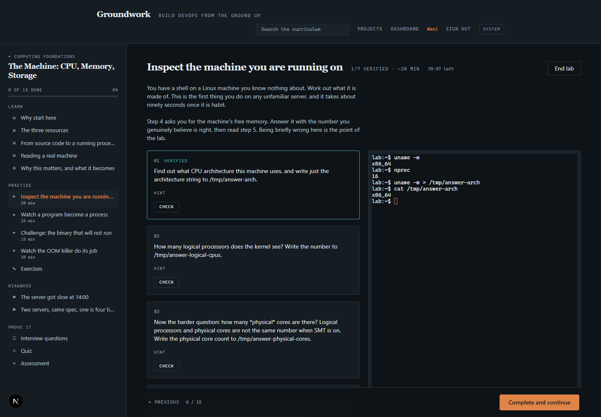
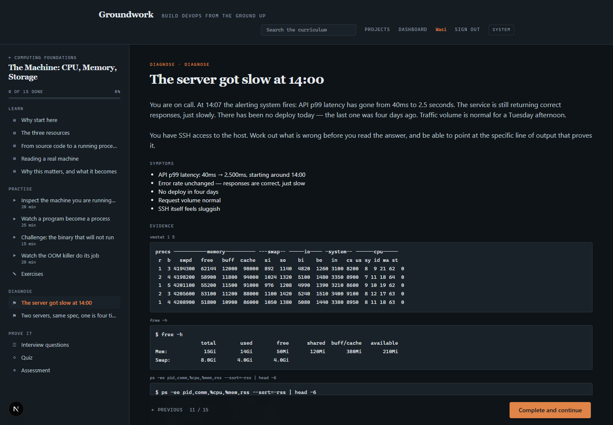
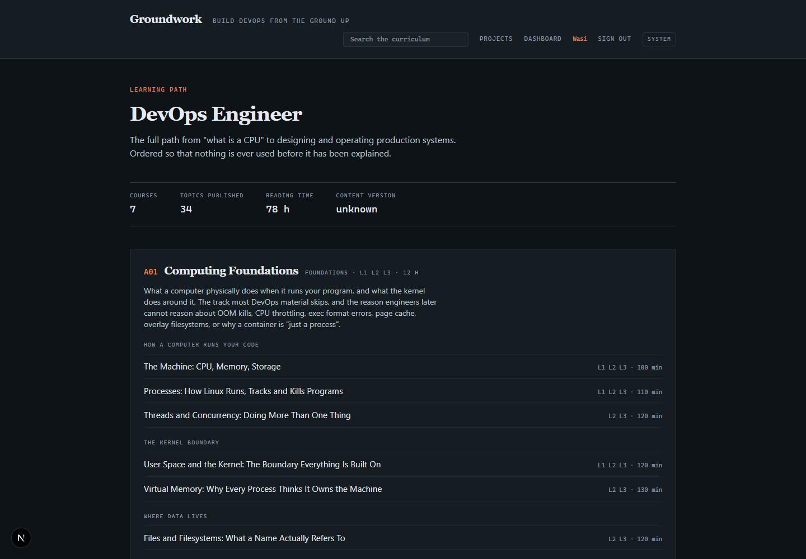
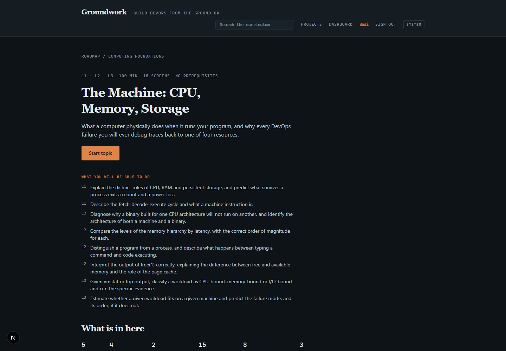
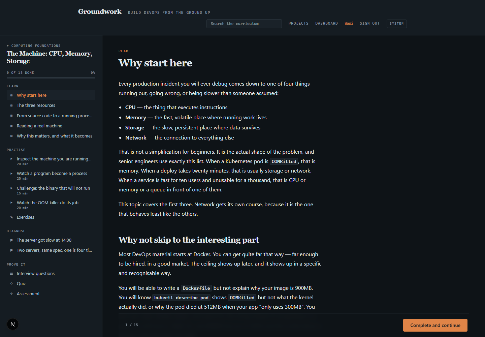
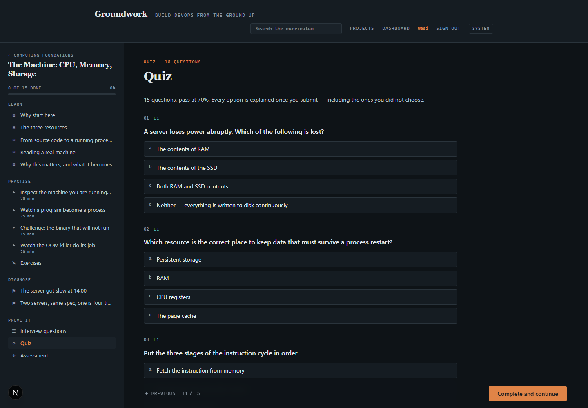
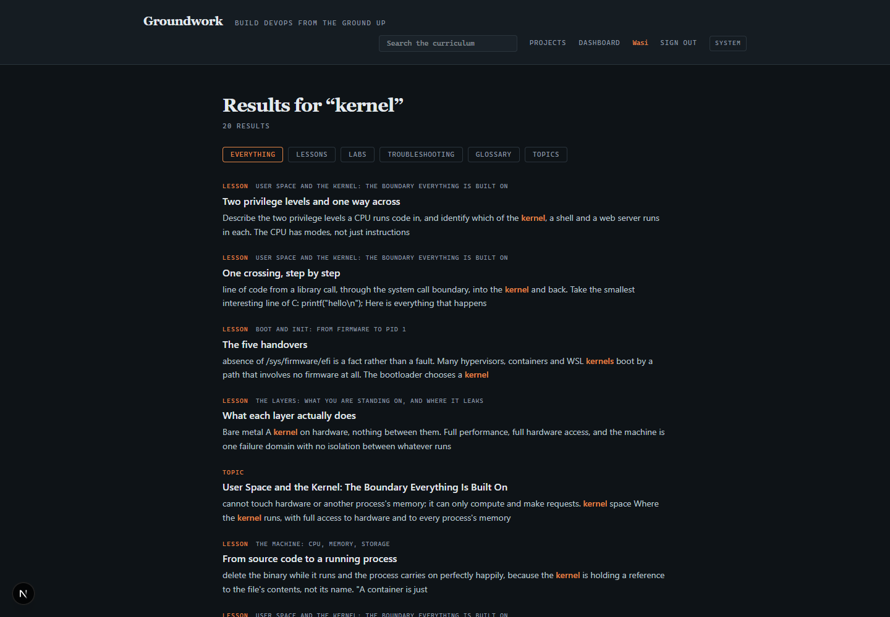
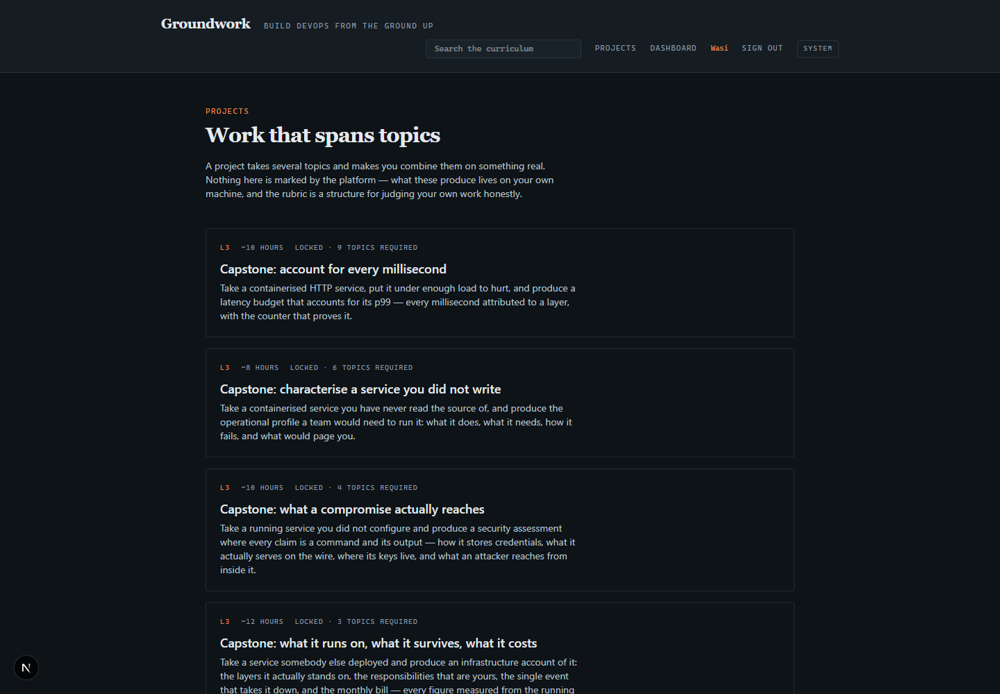

# Groundwork

**Build DevOps from the ground up.** A production-quality, self-hosted learning platform
that takes a learner from "what is a CPU" to "design and operate a multi-region production
platform".

Not a blog. Not a tutorial list. An interactive learning environment with a structured
curriculum, hands-on labs in real containers, troubleshooting scenarios, assessments and
progress tracking.

> **Status: Phases 0–4 complete; Phase 5 in progress.** A learner can register, work
> through a topic, be graded on it, run a real shell in a disposable container that
> verifies their work, search the curriculum, earn a verifiable certificate, and take on a
> project. The platform instruments itself, backs itself up, and proves it still starts
> from nothing.

## What it looks like

**A lab: instructions on the left, a real shell in a disposable container on the right.**
Each step is verified by running checks inside that container — `01 VERIFIED` below is the
platform having confirmed the learner's answer file, not the learner ticking a box.



**A troubleshooting scenario.** Symptoms and real command output, with the diagnosis and
the resolution revealed only after the learner commits to a hypothesis.



<details>
<summary>More — the path, a topic, a lesson, the quiz, search, projects</summary>

**The learning path.** Every course, ordered so nothing is used before it is explained.



**A topic.** Objectives, prerequisites, and everything the learner has to get through.



**A lesson.**



**A quiz**, scored against the topic's objectives.



**Full-text search across the curriculum**, built from public columns only, so it can
never surface a gated answer.



**Projects**, including four capstones.



</details>

## Read this first

| Document | What it covers |
|---|---|
| [docs/architecture/01-vision-and-principles.md](docs/architecture/01-vision-and-principles.md) | What we are building, non-negotiable principles |
| [docs/architecture/02-technology-stack.md](docs/architecture/02-technology-stack.md) | Every technology choice, alternatives considered, trade-offs |
| [docs/architecture/03-system-architecture.md](docs/architecture/03-system-architecture.md) | Services, Docker Compose topology, repository layout |
| [docs/architecture/04-content-model.md](docs/architecture/04-content-model.md) | How curriculum is authored, validated, versioned |
| [docs/architecture/05-data-model.md](docs/architecture/05-data-model.md) | Relational schema and the competence model |
| [docs/architecture/06-lab-architecture.md](docs/architecture/06-lab-architecture.md) | Sandboxed labs, isolation tiers, grading |
| [docs/architecture/07-security.md](docs/architecture/07-security.md) | Threat model and security architecture |
| [docs/architecture/08-testing-and-observability.md](docs/architecture/08-testing-and-observability.md) | Test strategy, platform telemetry |
| [docs/curriculum/ROADMAP.md](docs/curriculum/ROADMAP.md) | The full DevOps curriculum + prerequisite graph |
| [docs/plan/DELIVERY-PHASES.md](docs/plan/DELIVERY-PHASES.md) | Build phases, MVP scope, future scope |
| [docs/content-authoring/GUIDE.md](docs/content-authoring/GUIDE.md) | How to write curriculum |
| [docs/development/SETUP.md](docs/development/SETUP.md) | Local development |
| [docs/runbooks/](docs/runbooks/) | One per alert, plus the restore procedure |

## Running it

```bash
task bootstrap        # generate .env with real secrets
task up               # build, start, wait for healthy
# http://localhost:8080 — register, and the first account becomes the admin
```

Without Task: `cp .env.example .env`, edit the two secrets, `docker compose up --build -d`.

**No ingest step.** A one-shot `seed` service loads the curriculum after migrations, so a
first run gives you a usable platform rather than an empty one. `task verify:cold-start`
proves that from empty volumes, in an isolated Compose project, without touching the stack
you are working in.

Labs are opt-in, because the broker needs a container runtime:

```bash
task labs:build       # build the lab base image
task labs:up          # start the stack with the lab plane
task labs:terminal    # prove the terminal carries bytes both ways
task labs:walk        # walk every lab as a learner and assert its checks pass
```

Self-instrumentation is opt-in too:

```bash
task obs:up           # collector, Prometheus, Tempo, Loki, Grafana on :3000
task obs:verify       # assert signals reach their backends, and logs link to traces
```

## What exists today

| | |
|---|---|
| Services | proxy · web · api · worker · seed · db · cache — one published port |
| Profiles | `labs` · `observability` · `tools` — each opt-in, inert when off |
| Content pipeline | schema validation, 12 lint-rule groups, idempotent ingest, deterministic UUIDv5 keys |
| Curriculum | **35 topics** across 7 courses, 175 lessons, 140 labs, 525 quiz questions, 70 troubleshooting scenarios, 162 exercises, 181 interview questions, 105 assessment parts, 5 projects including four capstones |
| Reader | server-rendered lessons, Mermaid diagrams, inline shells (`:::try`), commit-before-reveal (`:::predict`), light/dark/system theme that diagrams and terminals follow |
| Accounts | Argon2id, opaque sessions in httpOnly cookies, per-account and per-IP rate limiting, Origin-checked mutations, audit log |
| Learning | Progress, prerequisite gating, **server-side quiz grading**, progressive-reveal troubleshooting, dashboard |
| Competence | Evidence weighted by how hard it is to fake; a topic scores as its **weakest** objective, and quizzes alone never reach proficiency |
| Certificates | Issued only when every objective is demonstrated; publicly verifiable at `/verify/<code>` |
| Projects | Gated on the topics they combine; rubric self-review where every score needs evidence. A01, A02+A03, A04 and A05 each end in a capstone requiring every topic they cover |
| Search | Postgres FTS across the curriculum, built from public columns only |
| Authoring | Admin-only view of what exists and what the linter says, plus a re-ingest that refuses invalid content. Content stays in files |
| Labs | Ephemeral hardened containers, browser terminal, nine declarative check types, per-learner quota, TTL with a reaper |
| Observability | OTLP traces, metrics and logs; 4 dashboards and 6 alerts as code, each with a runbook |
| Backups | `task db:backup`, and `task db:verify-restore` restores into a scratch database and asserts progress still resolves |

## How this is verified

Written as scripts rather than as instructions, and all of it runs in CI.

| Check | What it proves |
|---|---|
| 97 API tests · 26 broker tests | Units, and the content pipeline against real PostgreSQL |
| 56 smoke checks | The whole chain through the proxy, as a browser would |
| `task labs:walk` — 140 labs | Every lab's steps run as a learner would, and its own checks pass |
| `task labs:terminal` | The terminal moves bytes in both directions, and shows a prompt |
| `task verify:a11y` — 11 checks | One `main`, one `h1`, heading order, named controls, zoom, skip link, no `<p>` inside `<p>`, compression |
| `task verify:cold-start` | A fresh clone still works, from empty volumes |
| `task db:verify-restore` | A backup restores and progress still resolves to its topics |
| `task obs:verify` | Signals reach their backends, and a log line's `trace_id` finds its trace |
| `task check:compose` — 9 invariants | No privileged containers, one published port, no host bind mounts in labs |

The lab walker exists because three of the first eight labs were broken in ways that
passed every automated check: a path that did not exist, a demonstration that demonstrated
nothing, and an instruction needing a capability the sandbox drops. All three were found by
hand. That does not scale, so now a machine does it.

## Working agreement

The curriculum is built **one topic at a time**. A topic is not "done" until theory,
examples, labs, exercises, troubleshooting, quiz, assessment, prerequisites, objectives,
tests and docs all exist. See
[docs/plan/DELIVERY-PHASES.md#definition-of-done](docs/plan/DELIVERY-PHASES.md#definition-of-done).

Two rules that shape everything here:

**Nothing is claimed that has not been measured.** Where a limitation exists — no
point-in-time recovery, backups on the same disk, keyboard and screen-reader passes still
manual, tier-3 labs needing a Linux host — it is written down rather than left implied.

**Answer keys never leave the API.** Quiz correctness, troubleshooting root causes, lab
verification specs and model answers are excluded from every public response model, blocked
at the edge, and absent from the search index — with tests asserting each.
