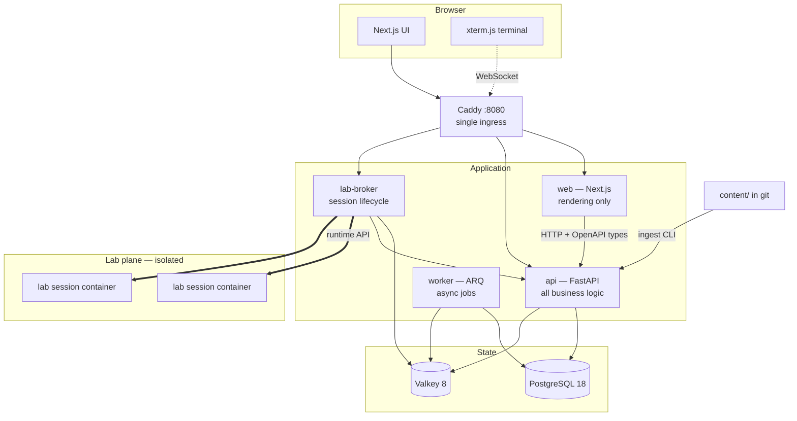

# 3. System Architecture

## 3.1 Component overview



## 3.2 Service responsibilities and boundaries

| Service | Owns | Must never |
|---|---|---|
| **proxy** (Caddy) | TLS termination, routing, the only published port | Contain business logic |
| **web** (Next.js) | Rendering, navigation, client interactions | Touch the database; hold secrets; make authz decisions |
| **api** (FastAPI) | All business logic, authz, content serving, grading, progress | Execute learner-supplied code |
| **worker** (ARQ) | Ingestion, reaping, scoring, indexing | Serve HTTP |
| **lab-broker** | Session create/attach/destroy, quotas, TTL, terminal proxy | Trust anything from a lab container |

The rule that keeps this migratable to Kubernetes: **services communicate only over HTTP
and Postgres/Valkey, never over a shared filesystem.**

## 3.3 The two planes

The most important structural decision is that the **application plane** and the **lab
plane** are separate, and the boundary between them is narrow and one-directional.

- Lab containers have **no credentials** for the API, the database or the cache.
- Lab containers get **no egress** by default (a lab that needs `pip install` gets an
  explicit allow-list and its own network).
- Verification results flow **out** of a lab via a signed, single-purpose channel, never
  by the lab writing to our database.
- The broker is the only component that touches the container runtime, and it is the only
  component that would need re-implementation to move labs to Kubernetes or Firecracker.

## 3.4 Docker Compose topology

`compose.yaml` (base, production-shaped) + `compose.override.yaml` (dev-only bind mounts
and hot reload, applied automatically).

```
default profile (docker compose up)
├── proxy        caddy:2                  8080:8080   ← only published port
├── web          ./services/web           internal
├── api          ./services/api           internal
├── worker       ./services/api (arq)     internal
├── db           postgres:18-alpine       internal, named volume
└── cache        valkey/valkey:8-alpine   internal, named volume

--profile tools
├── adminer                               DB browsing
└── mailpit                               SMTP capture

--profile labs
└── lab-broker   ./services/lab-broker    + lab-runner images

--profile observability
├── otel-collector
├── prometheus
├── loki
├── tempo
└── grafana                               3000

--profile search
└── meilisearch
```

**Networks** — not one flat network:

| Network | Members | Purpose |
|---|---|---|
| `edge` | proxy, web, api, lab-broker | Ingress only |
| `app` | api, worker, web, db, cache | Application internals |
| `data` | db, cache, api, worker | Could be collapsed into `app`; kept separate to model tiering |
| `labnet-<session>` | one lab session | Created per session, `internal: true`, destroyed with the session |

Splitting these costs nothing and makes the Compose file a legitimate teaching example for
network segmentation.

**Health and dependency ordering:** every service defines a `healthcheck`; `depends_on`
uses `condition: service_healthy`. `api` runs migrations via a one-shot `migrate` service
rather than on startup — running migrations from N replicas is a lesson we would rather
teach than experience.

**Volumes:** `pgdata`, `valkeydata`, `caddydata`. Content is bind-mounted read-only into
`api` in dev; baked into the image in the production build.

## 3.5 Repository structure

```
devops-path/
├── compose.yaml
├── compose.override.yaml            # dev: bind mounts, hot reload, debug ports
├── .env.example
├── Taskfile.yml
├── README.md
│
├── content/                         # THE CURRICULUM — the actual product
│   ├── versions.yaml                # pinned tool versions referenced by lessons
│   ├── glossary.yaml
│   ├── schemas/                     # JSON Schema for every content type
│   ├── paths/
│   └── courses/
│       └── 01-computing-foundations/
│           ├── course.yaml
│           └── modules/
│               └── 01-how-a-computer-runs-your-code/
│                   ├── module.yaml
│                   └── topics/
│                       └── 01-the-machine/
│                           ├── topic.yaml
│                           ├── lesson.md
│                           ├── diagrams/*.mmd
│                           ├── labs/*.yaml
│                           ├── exercises.yaml
│                           ├── quiz.yaml
│                           ├── troubleshooting/*.yaml
│                           ├── interview.yaml
│                           └── assessment.yaml
│
├── services/
│   ├── api/
│   │   ├── app/
│   │   │   ├── api/v1/              # routers only — thin
│   │   │   ├── core/                # config, security, logging, otel
│   │   │   ├── db/                  # session, base, repositories
│   │   │   ├── models/              # SQLAlchemy
│   │   │   ├── schemas/             # Pydantic (API contracts)
│   │   │   ├── services/            # business logic — the real code
│   │   │   ├── content/             # parser, validator, linter, ingester
│   │   │   └── workers/             # ARQ tasks
│   │   ├── alembic/
│   │   ├── tests/{unit,integration,content}
│   │   ├── pyproject.toml
│   │   └── Dockerfile
│   │
│   ├── web/
│   │   ├── src/
│   │   │   ├── app/                 # App Router
│   │   │   ├── components/
│   │   │   ├── content/             # directive → component renderer
│   │   │   └── lib/api/             # GENERATED from OpenAPI — do not hand-edit
│   │   ├── tests/
│   │   └── Dockerfile
│   │
│   └── lab-broker/                  # Phase 3
│       └── app/provisioners/        # docker.py, sysbox.py, k8s.py, firecracker.py
│
├── labs/
│   ├── images/                      # lab base images per track
│   │   ├── foundations/
│   │   ├── linux/
│   │   ├── networking/
│   │   ├── docker/
│   │   └── k8s/
│   └── labcheck/                    # static verification binary injected into labs
│
├── infra/
│   ├── caddy/Caddyfile
│   ├── db/init/
│   └── observability/{otel,prometheus,grafana,loki,tempo}/
│
├── e2e/                             # Playwright
├── docs/
└── .github/workflows/
```

**Why `content/` is a top-level sibling of `services/`:** it is the product, not an asset
of the API. It must be reviewable, diffable, and eventually extractable into its own
repository without touching application code.

## 3.6 Request paths

**Reading a lesson** (the hot path — must be fast):

```
Browser → Caddy → web (RSC)
                   └→ api  GET /api/v1/topics/{slug}
                            ├→ Valkey  (cached compiled AST + metadata)   ~2ms
                            └→ Postgres on miss                          ~15ms
```

Compiled Markdown AST is cached in Valkey keyed by `content_hash`, so a content change
invalidates naturally and no stale-cache logic is needed.

**Submitting a quiz** (must be trustworthy):

```
Browser → Caddy → api  POST /api/v1/quizzes/{id}/attempts
                        ├→ load answer key server-side  (never sent to browser)
                        ├→ grade, persist attempt
                        ├→ update user_progress
                        └→ enqueue achievement evaluation
```

Answer keys are stripped from every quiz payload the API serves. This is enforced by a
Pydantic response model that has no field for them, not by remembering to omit them.

**Starting a lab:**

```
Browser → Caddy → lab-broker  POST /labs/{slug}/sessions
                               ├→ verify entitlement with api
                               ├→ check per-user quota
                               ├→ provision container (limits, seccomp, no egress)
                               ├→ inject labcheck + issue session token (TTL)
                               └→ return { sessionId, wsUrl, expiresAt }
Browser ──WebSocket──→ Caddy → lab-broker ──attach──→ lab container
```

## 3.7 Kubernetes migration path

Nothing here needs redesign to move to Kubernetes:

| Compose concept | Kubernetes equivalent |
|---|---|
| `web`/`api` services | Deployments + Services |
| `worker` | Deployment (no Service) |
| `migrate` one-shot | Job / initContainer |
| Caddy routing | Ingress / Gateway API |
| `db`, `cache` | StatefulSets, or managed services |
| Compose profiles | Separate Helm values / kustomize overlays |
| networks | NetworkPolicies |
| lab containers | Pods in a dedicated namespace with quotas + `gVisor`/Kata RuntimeClass |

The one component that genuinely changes is the lab provisioner, which is exactly why it
is an interface with swappable implementations.
