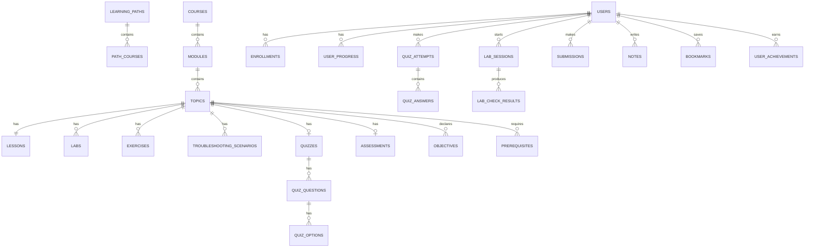

# 5. Data Model

PostgreSQL 18. Three domains: **content** (projected from git), **identity**, **progress**.

Design rules:
- Content tables are a *cache of git*. They are truncatable and rebuildable. They hold no
  authoritative state.
- Progress tables are authoritative and must never be lost.
- The join between them is a **deterministic UUIDv5 derived from the content `id` string**,
  so re-ingesting, renaming or reordering content cannot orphan a progress row.

```sql
-- conceptually: content_uuid = uuid_generate_v5(NAMESPACE_DEVOPSPATH, content_id_string)
```

## 5.1 Entity relationship overview



## 5.2 Content domain

| Table | Key columns | Notes |
|---|---|---|
| `content_versions` | `id`, `git_sha`, `ingested_at`, `is_current` | One row per successful ingest |
| `learning_paths` | `id (uuid5)`, `content_id`, `slug`, `title`, `summary`, `order` | |
| `path_courses` | `path_id`, `course_id`, `order`, `level` | Level lives on the *edge* — a course can sit at different levels in different paths |
| `courses` | `id`, `content_id`, `slug`, `title`, `summary`, `track`, `estimated_hours` | |
| `modules` | `id`, `course_id`, `slug`, `title`, `order` | |
| `topics` | `id`, `module_id`, `slug`, `title`, `summary`, `order`, `levels[]`, `estimated_minutes`, `status`, `content_hash`, `metadata jsonb` | The unit of work |
| `lessons` | `id`, `topic_id`, `section`, `body_md`, `body_ast jsonb`, `content_hash` | `body_ast` is the pre-compiled render tree |
| `objectives` | `id`, `topic_id`, `code`, `level`, `verb`, `statement` | |
| `objective_assessments` | `objective_id`, `assessable_type`, `assessable_id` | Enforces §1.5.3 in the data, not just the linter |
| `prerequisites` | `topic_id`, `requires_topic_id`, `hardness` | `hardness`: required \| recommended |
| `labs` | `id`, `topic_id`, `slug`, `title`, `type`, `tier`, `image`, `duration_minutes`, `spec jsonb` | `spec` holds steps + verify checks |
| `exercises` | `id`, `topic_id`, `prompt`, `kind`, `spec jsonb` | |
| `troubleshooting_scenarios` | `id`, `topic_id`, `title`, `level`, `reveal_policy`, `symptoms jsonb`, `artifacts jsonb`, `root_cause`, `method` | `root_cause` never leaves the API without gating |
| `design_challenges` | `id`, `topic_id`, `brief`, `constraints jsonb`, `rubric jsonb` | |
| `quizzes` / `quiz_questions` / `quiz_options` | ... `is_correct`, `explanation` | Answer key columns are excluded from every public response model |
| `assessments` | `id`, `topic_id`, `parts jsonb`, `pass_score` | |
| `interview_questions` | `id`, `topic_id`, `level`, `question`, `model_answer`, `follow_ups jsonb` | |
| `projects` | `id`, `slug`, `title`, `level`, `brief`, `rubric jsonb`, `requires_topics[]` | Cross-course |
| `glossary_terms` | `term`, `definition`, `defined_in_topic_id` | |
| `tags` / `content_tags` | | Polymorphic tagging |

**Full-text search:** a materialised `content_search` table with a `tsvector` column
populated at ingest, unioning topics/lessons/labs/glossary, with `pg_trgm` for fuzzy title
matching.

## 5.3 Identity domain

| Table | Notes |
|---|---|
| `users` | `id uuidv7`, `email citext unique`, `password_hash` (argon2id), `display_name`, `status`, `email_verified_at`, `created_at` |
| `roles`, `user_roles` | `learner`, `author`, `admin` |
| `refresh_tokens` | `id`, `user_id`, `token_hash`, `expires_at`, `revoked_at`, `user_agent`, `ip` — hashed so a DB read cannot mint sessions |
| `user_profiles` | Goal track, target role, weekly time budget — drives pacing |
| `audit_log` | `actor_id`, `action`, `target`, `metadata jsonb`, `at` — from day one, it is cheap and unfakeable later |

## 5.4 Progress domain

The central table, deliberately generic:

```sql
CREATE TABLE user_progress (
    id              uuid PRIMARY KEY DEFAULT uuidv7(),
    user_id         uuid NOT NULL REFERENCES users(id) ON DELETE CASCADE,
    entity_type     text NOT NULL,   -- topic | lesson | lab | exercise | quiz |
                                     -- troubleshooting | assessment | project | course
    entity_id       uuid NOT NULL,   -- deterministic uuid5, survives content churn
    status          text NOT NULL,   -- not_started | in_progress | completed | failed
    score           numeric(5,2),
    attempts        integer NOT NULL DEFAULT 0,
    time_spent_s    integer NOT NULL DEFAULT 0,
    first_seen_at   timestamptz,
    completed_at    timestamptz,
    content_version uuid REFERENCES content_versions(id),
    UNIQUE (user_id, entity_type, entity_id)
);
CREATE INDEX ON user_progress (user_id, entity_type, status);
```

**Why one generic table rather than a table per type:** the dashboard, the roadmap
completion view and the prerequisite unlock check all need "everything this user has done"
in one query. Per-type tables would make that a nine-way union on the hottest read path.
The cost is a lost foreign key on `entity_id`; we accept it and validate at write time in
one service function.

Supporting tables:

| Table | Notes |
|---|---|
| `enrollments` | `user_id`, `path_id`, `started_at`, `target_completion` |
| `quiz_attempts` | `user_id`, `quiz_id`, `score`, `passed`, `started_at`, `submitted_at`, `content_version` |
| `quiz_answers` | `attempt_id`, `question_id`, `given jsonb`, `is_correct` — enables per-objective weakness analysis |
| `lab_sessions` | `id`, `user_id`, `lab_id`, `state`, `provisioner`, `container_ref`, `started_at`, `expires_at`, `destroyed_at`, `resource_profile` |
| `lab_check_results` | `session_id`, `step_id`, `check_index`, `passed`, `detail jsonb`, `at` |
| `submissions` | For exercises, design challenges, projects: `body`, `artifact_url`, `reviewed_by`, `rubric_scores jsonb` |
| `skill_assessments` | Rolled-up per-track competence, computed from objective-level evidence |
| `notes` | `user_id`, `entity_type`, `entity_id`, `anchor` (heading id), `body_md` |
| `bookmarks` | `user_id`, `entity_type`, `entity_id` |
| `achievements`, `user_achievements` | Rule-based, evaluated in the worker |

## 5.5 The competence model (why we do not just count quizzes)

Requirement §35 says a passed multiple-choice quiz must not mark a learner proficient.
Mechanically:

```
objective_evidence(user, objective) = aggregate over:
    quiz_answers on questions mapped to that objective   (weight 1)
    lab_check_results on labs mapped to that objective   (weight 3)
    troubleshooting outcome                              (weight 4)
    assessment part score                                (weight 4)
    design challenge rubric                              (weight 5)

topic proficiency = min(objective_evidence) across the topic's objectives at that level
```

Taking the **minimum**, not the average, is the point: you are as strong as your weakest
objective, and it makes gaming the score by acing the easy quiz impossible.

## 5.6 Migration discipline

- Alembic, autogenerate reviewed by hand every time.
- Every migration is tested forward *and* backward in CI against a seeded database.
- Additive-then-backfill-then-remove for column changes — never a destructive single step.
- Content tables may be rebuilt from git; progress tables never accept a destructive
  migration without an explicit backup step in the same PR.

## 5.7 What we are deliberately not building yet

Content A/B testing, spaced-repetition scheduling, per-user content personalisation,
multi-tenant organisations, cohort/classroom features, and payment. Each would add tables;
none is needed to learn anything.
