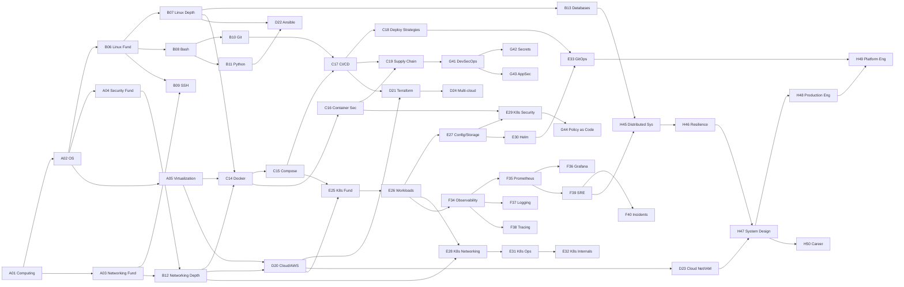

# DevOps Curriculum Roadmap

The complete curriculum: 8 tracks, 48 courses, ~180 modules, ~700 topics, 11 projects.

This is the *product backlog*. It is deliberately more than a year of work at any sane
pace, and that is fine — it is ordered, so the front of it is always the right thing to
build next.

**Reading the table columns:** `L` = the difficulty levels the course spans (see
[principles §1.4](../architecture/01-vision-and-principles.md#14-difficulty-ladder)).

---

## Track A — Foundations *(assume nothing)*

The track most platforms skip. It is the reason people plateau at "I can copy Kubernetes
YAML but I don't know why anything works."

| # | Course | L | Modules |
|---|---|---|---|
| A01 | **Computing Foundations** | L1–L3 | The machine (CPU, memory, storage, architectures) · Processes and signals · Threads, concurrency and CPU limits · The kernel boundary and syscalls · Virtual memory, page cache and OOM · Files, inodes and overlay filesystems |
| A02 | **Operating Systems** | L2–L3 | **Isolation primitives** — namespaces · cgroups as a hierarchy · **Scheduling in depth** — CFS/EEVDF, priorities, cgroup weights · **The block layer** — I/O schedulers, queues, writeback · **Boot and init** — firmware → bootloader → init, systemd units and ordering, PID 1 in a container |
| A03 | **Networking Foundations** | L1–L2 | Why networks need layers · OSI vs TCP/IP · Ethernet, MAC, ARP · IPv4 & IPv6 addressing · Subnets & CIDR · Routing & gateways · NAT · DHCP · DNS · Ports & sockets · TCP vs UDP · HTTP basics |
| A04 | **Security Foundations** | L1–L2 | **Hashing** — integrity, passwords, work factor, HMAC, content addressing · Symmetric and asymmetric encryption · Certificates, TLS and PKI · Identity, least privilege and the trust store |
| A05 | **Virtualization & Cloud Foundations** | L1–L2 | **The layers** — bare metal → VM → container → function, what each virtualises and where it leaks · Hypervisors and microVMs · What "the cloud" sells: IaaS/PaaS/SaaS · Regions, AZs and failure domains · The shared responsibility model · Cost models |

### Where else A01 changed the plan

The same sweep was run against every other planned course. Two more needed
adjusting and one did not, and the difference is worth recording.

**B06 Linux Fundamentals** listed "files, links, inodes", which A01.5 now teaches
with labs. B06 keeps the practical surface — hierarchy, permissions, users,
tooling — and uses inodes rather than introducing them.

**B07 Linux in Depth** listed "processes & signals in practice" and "memory
tuning & OOM analysis", both of which A01.2 and A01.4 cover at L3 with
measurement. B07 keeps the operational layer above them: systemd, journald, LVM,
sysctl, and the troubleshooting methodology.

**C14 Containers & Docker** was flagged by the same search and is *not*
duplication. It needs namespaces, cgroups, overlayfs and PID 1 in container
framing, and A01 deliberately foreshadows exactly that — a learner arriving at
C14 has measured the mechanisms and is now being shown the product built on
them. That is reuse working as designed, and the roadmap says so to stop someone
"fixing" it later.

Two flags were false positives worth naming, because the search will produce
them again: C16's `seccomp` appears in A01's glossary without being taught
there, and F34's "signals" are metrics, logs and traces — a different word that
happens to collide.

### A note on A01 and A02, added after building A01

A01 was planned as an L1–L2 survey and became an L1–L3 course of six topics and
twelve hours. Building it deeply turned out to be the right call — the labs
measure real behaviour on a real machine, and that depth is what makes the
container tracks land later — but it consumed most of what A02 was scheduled to
teach.

Four of A02's original modules are now covered at greater depth in A01: kernel
and syscalls, process lifecycle and signals, memory management and OOM, and
filesystems. Writing them again would produce a worse second version of content
that already exists.

So A02 has been re-scoped to what genuinely remains: the namespace and cgroup
primitives that C14 needs, scheduling internals, the block layer, and boot and
init. It starts at L2 rather than L1 accordingly, because a learner reaching it
has already done the foundations at L3 — the first thing it can assume is that
they have read their own capability set and their own overlay mount, which is
what makes "a container is eight symlinks" land as a finding rather than a
claim.

The general lesson, recorded because it will recur: **the depth a course reaches
is a decision made while writing it, and it changes what the next course should
contain.** A roadmap written before any content exists is a hypothesis, and this
one has now been corrected by evidence rather than followed off a cliff.

### A note on A04, added while building it

A04 was planned as ten bullet points and was built as four modules — hashing,
encryption, certificates and TLS, and identity and least privilege. Three of the
original ten are not modules, and the reasons differ.

**CIA triad** is a vocabulary item, not a topic. It is three words that take a
paragraph to define and cannot be assessed beyond recall, so it appears in the
terminology of the topics that actually use it rather than as a lesson nobody
can be graded on.

**Common attack classes** was a list without a mechanism. Taught as a list it
becomes memorisation; taught properly each entry belongs beside the primitive it
subverts — length extension sits in hashing, downgrade attacks sit in TLS,
privilege escalation sits in the identity module. It has been distributed rather
than dropped.

**Threat modelling** genuinely needs its own treatment and does not belong at
L1–L2 with nothing concrete to model. It moves to a later course, where a
learner has a system in front of them worth modelling.

The sandbox also decided some scope. A lab container has no network egress, so
everything here is demonstrated locally — which turned out to be an improvement
rather than a constraint: a learner builds their own CA, signs their own
certificate and watches `openssl s_client` produce three distinct verification
failures, none of which requires the internet or a cooperating remote server.

### A note on B06, added before building it

B06 was planned as seven modules and two and a half of them are now taught
elsewhere, at greater depth, with labs. Writing them again would produce a worse
second version of content that already exists — the same problem A02 had.

**Permissions, ownership and special bits** are A04.4. That topic teaches the
permission bits, the first-matching-class rule, the directory execute bit,
`umask`, `setuid` and `namei` — all measured, and framed by what a compromise
reaches. B06 uses them.

**Users, groups and sudo** are largely A04.4 as well: identity as numbers,
supplementary groups, and `/etc/shadow`. What remains — creating accounts, sudo
policy — belongs with the operational layer in B07.

**Text processing** is B08's explicitly, which lists grep, sed, awk, find and
xargs as its own module. Splitting it across two courses would teach it twice
and badly.

**Inodes and links** were already assigned to A01.5 by the earlier sweep.

So B06 is four modules: what a distribution actually is and how releases work,
the filesystem hierarchy, package management, and environment and shell startup.
Every one of those is genuinely unclaimed, and all four are measurable — a
container knows exactly which distribution it is, which packages it has and
where they came from.

The general lesson is the same one A02 and A04 recorded, now confirmed a third
time: **check what the built curriculum already covers before writing a planned
module.** The roadmap is a hypothesis, and by the time a course comes up its
neighbours have usually taken some of it.

### What building B06.2 found

Packages was taken second rather than third, because it follows directly from
version semantics and the filesystem hierarchy does not. Probing the sandbox
first changed the topic substantially, and three findings are worth recording
because they are what the labs are built on.

**The lab image is itself the best example of every failure mode.** `dpkg -S`
on `/opt/lab/seed-*.sh` returns nothing, because this platform's own files are
unowned — the same answer a learner will get about a vendor agent. And `dpkg -V`
reports exactly one checksum mismatch, on `/etc/bash.bashrc`, because the
Dockerfile appends the lab prompt to a `bash` conffile. Neither was arranged.

**The signal-to-noise ratio is 1 in 4,634.** `dpkg -V` on `debian:13-slim`
returns 4,633 `missing` lines for documentation the slim variant deliberately
strips, and one real finding. That number turned the integrity topic from a
command reference into the more useful lesson: a control producing thousands of
findings on a healthy machine is a control that will be suppressed or ignored,
and the same argument applies to B06.1's vulnerability scanner.

**Nothing in the image arrived via `Recommends`,** because the build uses
`--no-install-recommends` — so `psmisc` is absent, and `pstree`, `killall` and
`fuser` are all missing from a machine where `procps` is installed. That is the
undeclared-dependency scenario made real rather than hypothetical, and it
produced the better version of the failure: a guard written as `if fuser … ;
then` does not fail when the command is absent, it **inverts**, because the
shell returns 127 and `if` reads that as false.

### What building B06.3 found

The hierarchy is the module most at risk of becoming a table of directories, so
it was scoped around the two things a table cannot do: the package database
proves the layout is an ownership contract, and the lab container proves what a
read-only root actually costs.

**Three directories are owned by nothing, and that is enforced.** `dpkg -S`
returns nothing for `/usr/local`, `/opt` and `/srv`, while `/var/log` is owned by
`base-files` and `apt` — the contrast is what shows the refusal is deliberate.
Across all 162 packages, zero ship a file under `/usr/local` or `/opt`; the
directories are created by a `base-files.postinst` function named
`install_local_dir`. That turns B06.2's unowned-file discovery into something the
hierarchy predicts in advance.

**`/usr` is 306 MB of a 320 MB image**, and `/bin`, `/lib`, `/lib64` and `/sbin`
are symlinks into it — `/bin/sh` and `/usr/bin/sh` are the same inode. The
usr-merge is what makes an image one hashable tree.

**The lab container is the read-only-root lesson.** It runs `ReadonlyRootfs` with
tmpfs at `/tmp`, `/home/learner` and `/run`, so nine ordinary startup writes
produce six refusals — five from the mount and one from the mode. `/run` is
mounted `rw` and is `755 root:root`, so an unprivileged process still cannot
write it: both gates are independently checkable in the same container. And
`/dev/shm` is writable `1777` yet `noexec` — a Docker default the broker never
configures, harmless only because of the mount option.

The masking lesson came free. The Dockerfile already documents that a tmpfs over
`/home/learner` masks anything baked in there, which is why the lab shell
settings live in `/etc/bash.bashrc`; `mountpoint /home/learner` confirms it at
runtime. So the troubleshooting scenario about a volume hiding files is
demonstrable on the machine rather than hypothetical.


### What building B06.4 found

The last B06 module, and the one with the highest ratio of production pain to
conceptual difficulty. Probing settled a matrix that most documentation states
slightly wrongly.

**Four shell modes, measured against files that actually exist on the image.**
`/etc/bash.bashrc` sets `HISTFILE`, so which modes read it is a one-command
question. Result: `bash -c` — the shell every script, cron job, systemd unit and
CI step runs in — reads **nothing at all**.

**The corner the usual summary gets wrong.** A login shell does *not* read
`~/.bashrc`, even when interactive. It works on a real account only because the
default `~/.profile` sources it, and `/etc/skel/.profile` on the image contains
exactly that. That also explains the `case $- in *i*) ;; *) return;; esac` guard
everyone has seen and nobody explains: `~/.profile` sources `~/.bashrc`
unconditionally and runs for non-interactive login shells, so without the guard
`ssh host 'cat file'` would splice your prompt output into the data stream —
which is what breaks `scp` and `rsync`.

**PATH is an output, not a setting.** `/etc/profile` branches on `id -u` and
*assigns* rather than appends, so a non-root **login shell has a shorter PATH
than a script**: `capsh` and `ldconfig` are unreachable from `bash -lc` and
reachable from `bash -c`. That is backwards from the usual cron story and made a
much better lab than the cliché. `ip` is unaffected because `/usr/sbin/ip` is a
symlink to `../bin/ip` — a reminder that "it is in sbin" predicts nothing.

**`/proc/PID/environ` is an execve snapshot, not a view.** A variable exported
later never appears there, and — the part that matters — **`unset` does not
remove a secret from it**. Only a fresh exec does. That single measured fact
carries the whole secrets half of the topic, including a troubleshooting scenario
where a security finding was closed on a re-test that checked the one property
the fix had changed.

**A correction worth recording.** I first wrote that bash's fallback PATH ending
in `.` lets an attacker's `./ls` shadow the real one. Measuring it showed `.` is
searched **last**, so it cannot shadow anything — the real hazard is that a
*missing* command silently succeeds against whatever is in the working directory.
The corrected version is both true and a better lesson, and it was wrong in four
places before the lab walk caught it.


## Track B — Core Craft *(the daily tools)*

| # | Course | L | Modules |
|---|---|---|---|
| B06 | **Linux Fundamentals** | L1–L2 | **The distribution** — what one is, release models, version semantics · **Packages** — file ownership, dependency strengths, the closure, conffiles, integrity · **The filesystem hierarchy** — the ownership contract, config/state/cache, read-only roots, mount gates · **Environment & shell startup** — the four shell modes, PATH construction, the exec snapshot, secrets in the environment — *inodes and links are A01.5; permissions, ownership, special bits and groups are A04.4; text processing is B08. This course uses all of them rather than teaching them* |
| B07 | **Linux in Depth** | L2–L4 | systemd units, targets, timers · journald & log management · Disk, LVM, mounts, quotas · Memory *tuning* — swappiness, overcommit, cgroup pressure · Network configuration · Kernel parameters & sysctl · Performance tools (top/vmstat/iostat/ss/perf) · **Systematic troubleshooting methodology** — *builds on A01.2 and A01.4 rather than repeating them* |
| B08 | **Shell & Bash Scripting** | L1–L4 | **Expansion and quoting** — the eight stages, word splitting, globbing, "$@", POSIX vs bash · **Pipes and redirection** — descriptors, ordering, truncation, subshells, PIPESTATUS, buffering · **Searching text** — exit codes, BRE vs ERE, -F, field splitting · **Finding files** — predicates, -mtime truncation, -prune, exec forms, xargs safety · **Script structure** — errexit's exemptions, masked statuses, arithmetic, traps that run twice, a preamble worth defending · **Functions and scope** — dynamic scope, subshell boundaries, the four ways to return a value, exit status as one byte · **Arguments and options** — "$@", shift, getopts and OPTIND, getopt(1), a command-line contract · **Concurrency and locking** — overlapping runs, flock on the inode, stale locks, timeout -k, safe retries · **Testing shell** — what a green suite is worth, bats, PATH doubles, choosing cases from boundaries and failure paths |
| B09 | **SSH & Remote Access** | L2–L4 | SSH protocol & handshake · Keys, agents, forwarding · `~/.ssh/config` · SCP/rsync · Tunnels & jump hosts · Hardening sshd · Certificate-based SSH · Debugging failures |
| B10 | **Git & Version Control** | L1–L4 | Why version control · Objects, refs, the DAG (**internals first**) · Staging & committing · Branching & merging · Rebase vs merge · Cherry-pick, revert, reset · Reflog & recovery · Remotes & PRs · Conflict resolution · Workflows (trunk, GitFlow, GitHub Flow) · Hooks · Submodules & monorepos · Bisect & forensics |
| B11 | **Python for DevOps** | L1–L3 | Language essentials · Data structures · Files & paths · Errors & exceptions · Virtual envs & `uv` · Logging · argparse/typer CLIs · HTTP clients & APIs · JSON/YAML/TOML · Templating (Jinja2) · Testing with pytest · Packaging & distributing tools |
| B12 | **Networking in Depth** | L2–L5 | TCP deep dive (handshake, windows, retransmit) · DNS internals & resolution path · TLS handshake & certificate validation · HTTP/1.1 vs 2 vs 3 · Load balancing (L4 vs L7, algorithms) · Reverse proxies · Firewalls & iptables/nftables · VPNs · Packet capture with tcpdump/Wireshark · **Network troubleshooting scenarios** |
| B13 | **Databases for DevOps** | L2–L4 | Relational model & SQL · PostgreSQL operations · Indexes & query plans · Transactions & isolation · Connection pooling · Replication & failover · Backup & **tested restore** · Migrations & zero-downtime schema change · Redis/Valkey · NoSQL concepts · Performance troubleshooting |


### Why B10 has no separate "Reflog & Recovery" topic

The B10 module list names "Reflog & recovery" as a topic between the undo work
and remotes. Building it would now duplicate rather than teach.

A sweep after B10.5: `reflog` appears in 30 files across four topics,
`ORIG_HEAD` in 15, rescue branches in 10, `fsck` in 6. B10.4's third lab
recovers an abandoned branch three separate ways — ORIG_HEAD, a rescue branch,
and the reflog — and then finds the one thing that cannot be recovered. B10.5's
internals lesson explains why the reflog rather than the object store is what
expires.

That happened because recovery is the natural payoff of each topic rather than a
subject of its own: B10.1 established that unreachable is not gone, and every
topic since has cashed that in where it arose. Teaching it again as a topic would
mean re-deriving facts the learner has already measured.

What is genuinely not yet covered is narrower than a topic: `gc.reflogExpire`
timings, `fsck --lost-found`, and recovering a dropped stash. Those belong in
B10.9's conflict-resolution work or as a production section elsewhere, not as
ninety minutes of their own.

**So B10 goes from Undoing Things straight to Remotes and Pull Requests.** This
note exists so the gap reads as a decision rather than an omission, in the same
way the C14/A01 note does.

### What building B10.5 found

The undo topic, and the one where two probes measured nothing before either
produced a usable result.

**`git cherry-pick` has no `-q` flag.** The first probe used it, the command
failed, the surrounding script carried on, and the output looked like a real
measurement. Caught only because a file was missing from a HEAD that should have
contained it. A flag that does not exist fails loudly on its own line and
silently in a pipeline of echoes.

**A revert is an inverse patch and can conflict.** Lab 1's first version put the
bad line adjacent to a later good line, and reverting the bad commit conflicted —
the inverse patch's context included a line that did not exist when the bad
commit was made. The lab asserted four commits and a clean file; reality was
three commits and a UU. Fixed by separating the changes, and the finding kept as
a teaching point, because "revert the bad commit" sounds atomic and can turn
into a merge under incident pressure.

**Cherry-pick does not always produce a new id.** Measured: onto a branch that
has not moved since the source's parent, every input to the hash is identical —
parent, tree, message, author, committer timestamp — so the copy IS the original
object. That separates "cherry-pick creates a new commit object", always true,
from "cherry-pick creates a new id", true only when an input differs. Same shape
as the B10.4 finding, and content addressing being consistent rather than clever.

**Reverting a merge does not un-merge it.** Verified end to end: revert -m 1
removes the files, merging the branch again reports "Already up to date" and
returns nothing, `branch --merged` still lists it, and its commit is still
reachable. The work is missing from the working tree, not from history, and
merge only asks the second question.

**"The commit is in history" and "the change is in the tree" are different
claims.** `git branch --contains` answers the first and people stop there. A
revert, an overwrite, or a merge resolved toward the other side makes them
differ, and only the second one determines whether the bug is back. This became
the topic's recurring sentence and the troubleshooting scenario's whole point.

**Revert and cherry-pick are the same machinery with the sign flipped** —
cherry-pick applies (commit^ -> commit), revert applies (commit -> commit^).
That one line explains why both conflict, both produce index stages 1/2/3, both
resolve with add and --continue, and both stop on an empty result.

### What building B10.4 found

The rebase topic, and the one where a claim I had already written turned out to
be wrong when measured. Worth recording as a finding rather than a fix.

**"A rebase makes you resolve the same conflict once per commit" is an
overstatement**, and it is the version essentially every treatment gives. With
main at 99 and a branch bumping 1 -> 2 -> 3, resolving the first conflict to 2
produces no second conflict at all, because the tree then matches what the next
commit expects. Resolving it to 99 produces a second conflict of ours=99
theirs=3. The recurrence is a consequence of the resolution, not of the rebase —
which changes what a learner should do when they hit the second one, and reveals
that someone resolving toward main every time may be quietly discarding their
branch's work.

**The author/committer distinction needs both dates pinned to demonstrate.**
Setting only GIT_AUTHOR_DATE shows identical readings before and after a rebase,
so the experiment passes and proves nothing. Pinning both shows author preserved
at 2024-01-15 and committer rewritten to today.

That was the third check in three topics that ran, passed and established no
fact — after B10.2's verify pattern split across two echo lines and its two
duplicate YAML keys. Three is a pattern rather than three coincidences, and the
lesson is that "the check passed" and "the check tested something" are separate
claims that have to be established separately.

**Ours during a rebase is the branch you are replaying onto.** Measured: stage 2
held main's value and stage 3 held the commit being replayed. Explaining it
mechanically — ours always means HEAD, and a rebase checks out the new base —
turns a gotcha into something derivable.

**A rescue branch is a better recovery than a reset.** `git branch rescue <sha>`
makes the abandoned commits reachable without moving your branch, so both
histories exist and can be diffed before deciding. That is usually what someone
actually wants after a rebase they are unsure about, and it costs 41 bytes.

**The one thing that cannot be recovered is the one thing that was never an
object.** git hash-object computes an id without writing it, so an unstaged edit
has nothing in the store and no reflog entry mentions it. Every other operation
in the topic moves refs around an append-only store.

### What building B10.3 found

The merging topic, and the one where the framing mattered more than the
material. "A merge compares two branches" is the natural sentence and it is
wrong in a way that makes everything downstream unexplainable: given only
"yours says 90, theirs says 30", nothing can decide which side changed it. The
topic is built on the correction — a merge compares each side against their
merge base — and conflicts, fast-forward and the whole-file hazard all fall out
of it.

**Nothing records where a branch came from.** Measured: merge-base returns the
same commit as rev-list --max-parents=0, and the answer is derived from parent
links every time it is asked. Candidates who assume it is recorded usually also
believe deleting a branch can lose commits, and both misconceptions come apart
together.

**Identical changes on both sides do not conflict.** Measured. That sharpens the
rule from "both touched it" to "both produced different content", which is
content addressing showing up again — the comparison is between blob ids.

**The absence of a conflict carries almost no information.** It means no region
was changed by both sides. It says nothing about whether the result is correct,
which is the whole of the semantic-conflict problem and the reason CI has to run
on the merge result rather than the branch. This became the topic's recurring
sentence rather than a footnote.

**A whole-file resolution against a stale base silently reverts work.**
`checkout --ours` replaces the entire file, including regions that side never
changed. Against a recent base that is nearly harmless; against a four-week-old
base it discards a month of the other side's work and reports nothing, because
nothing conflicted there. That became the troubleshooting scenario, and it is
the most useful thing in the topic.

**Empty directories vanish across a branch switch.** The troubleshooting
directory was created with mkdir and lost when I moved between branches, because
git does not track empty directories. The file then failed to write and lint
reported a missing scenario rather than a missing directory.

**Backticks in a commit message are command substitution.** `-X ours` and
`checkout --ours` were executed and silently removed from the message, leaving a
sentence about "the pair whose names hide a difference" with neither name in it.
Repaired by amending from a file.

### What building B10.2 found

The topic about the index, and the one where the sandbox turned out to be more
capable than expected. `git add -p` is interactive, which looked like it ruled
out teaching partial staging in a lab — until it turned out to read its answers
from stdin. `printf 'y\nn\n' | git add -p <file>` stages the first hunk and
rejects the second, so the whole thing is scriptable and walkable.

**The first attempt staged both hunks.** With the two changes six lines apart
they merge into one hunk under three lines of context, so the "y" took
everything and the "n" answered nothing. The lab's central claim was silently
false until the file was widened to twenty lines with changes at 1 and 20. Worth
remembering that a demonstration can pass while proving nothing.

**One path really does have three object ids at once**, and printing all three
is what makes the rest of the topic fall out:

    HEAD:    b2875d05    what is committed
    index:   1098d634    what is staged
    disk:    1fba146e    what you are editing

Status's two columns, the three forms of diff and reset --soft/--mixed/--hard
are then one question — which of the three am I moving — rather than three
vocabularies.

**A conflict is not a file with markers in it.** `git ls-files --stage` during
one shows three entries for the same path at stages 1, 2 and 3 — base, ours,
theirs. The markers are only how Git renders that into the working tree. It also
explains why `git add` is how you declare a conflict resolved: it collapses the
three entries into one.

**A verify passed lint and could never match.** The walkthrough split the phrase
"all three copies agree" across two echo lines, so the pattern found nothing.
Only the lab walk caught it — lint cannot see inside a walkthrough's output.

**Two YAML `hints:` keys in one file, and lint stayed green.** Inserting a block
ahead of an existing one silently discarded three hints, because YAML keeps the
last duplicate key. Nothing errors. Worth a rule eventually; for now, worth
knowing that a passing lint is not evidence a file says what you think.

### What building B10.1 found

The first topic of B10, and the first that needed a tool the lab image did not
have. The instinct was a dedicated `lab-git` image, on the grounds that a tool
which can clone, fetch and push is a larger thing to hand all 140 labs than a
test runner is. That argument did not survive checking: the broker puts every
lab on an `Internal` Docker network, `allow_egress` defaults to false, and the
content schema has no field to request otherwise, so git has nothing to reach.
Verified by running curl from a container on an internal network. One image
stays, and the Dockerfile header now records the reasoning rather than the
conclusion.

**The image is measured by two topics, and adding to it breaks them.** B06.2 and
B06.3 quote this image's package counts throughout their prose — 16/162 became
17/163 with bats, then 18/175 with git. The *checks* were made count-independent
first (comparing against live `apt-mark` output rather than pinning a constant),
so only prose needed resyncing. That is the pattern worth keeping: assert the
relationship, not the number, and a lab stops being a tripwire for unrelated
work.

**One failing step meant fourteen wrong files.** The regression walk caught a
single assertion, but the stale counts were quoted across lessons, quiz,
exercises, interview questions and a mermaid diagram — none of which any test
reads. Prose is unverified by construction, so the blast radius of a measured
fact is always wider than the failure it produces.

**`--amend` leaves the old commit reachable if a branch still points at it.** I
had written a lab step asserting the pre-amend commit would be orphaned, and
measured 1 rather than 0 — the branch created two steps earlier still named it.
The accident is a better lab than the plan: the step now shows reachable=1, has
the learner delete that branch, shows 0, and only then shows the commit is still
in the store. Reachability becomes demonstrated rather than defined.

**A relative markdown link in a lesson always 404s**, and only a human clicking
it will ever find out. `[labs](../labs)` had shipped in A01.1: well-formed
markdown, a target directory that genuinely exists, lints and ingests clean, and
the lab walk never reads lesson prose. Now a `link-relative` lint rule, as an
error — the sweep found exactly one occurrence in the whole curriculum.

**Content addressing gives the topic its spine, and every claim is one command.**
`sha1("blob 6\0hello\n")` reproduces `git hash-object` byte for byte; an
unchanged file keeps its blob id across commits so LICENSE is stored once for
three commits; a ref is 41 bytes and `git branch` creates no objects; and after
`git rm` plus a commit, `git cat-file -p` still prints the secret. That last one
is the whole production lesson — a leaked credential is disclosed the moment it
is pushed, so rotation is the fix and history rewriting is hygiene.

### What building B08.1 found

The first B08 module, and the first course whose subject is a *language* rather
than a system. That changed the probing: instead of measuring a machine, the
question was which behaviours produce production bugs and can be demonstrated in
one line.

**The order is provable, not just documented.** `n=3; echo {1..$n}` prints the
literal `{1..3}`, because brace expansion is stage 1 and parameter expansion is
stage 3. If the stages ran in any other order the output would be `1 2 3`. That
single line justifies teaching the sequence rather than a list of rules.

**Glob results are never re-split; variable contents are.** `for f in *.log`
returns `a file.log` as one word, while `for f in $v` splits it into two. The
asymmetry falls out of word splitting being stage 6 and globbing stage 7 — so
"use a glob, never parse ls" stops being folklore and becomes a consequence.

**The seeded directory produced a better lesson than intended.** It contains a
file whose name holds a newline, which makes `ls *.log | wc -l` report **7**
while `argc *.log` reports **6** — the same six files. That was not planned; it
fell out of building a realistic hostile fixture, and it demonstrates the
don't-parse-ls rule more convincingly than any argument.

**Four of fifteen predictions surprise people**, and they are the four worth
building a lab around: an unquoted empty variable expands to *zero* arguments
(hence `[ $x = y ]` failing with "unexpected operator"); a variable containing
`*.log` is globbed, so the result depends on the working directory; an unmatched
pattern stays literal, so a loop over an empty directory runs once; and a brace
range cannot see a variable.

**`local` is not a bashism.** It is commonly listed as one and works fine in
dash. What does fail under `/bin/sh` is `[[`, arrays and here-strings — checked
rather than assumed, which caught the error before it shipped.

A scoping note: the roadmap lists "expansion order" and "quoting" as separate
modules. They are inseparable — you cannot teach word splitting without teaching
the control on it — so this module covers both, and the later quoting slot is now
free for pipes and redirection to move up.


### What building B08.2 found

Pipes and redirection is a topic everyone thinks they know, so it was scoped
around the three failures that produce **no error at all** — and each turned out
to be one line to demonstrate.

**`2>&1` copies the current target of descriptor 1, not the name.** So
`cmd >f 2>&1` captures both streams and `cmd 2>&1 >f` sends errors to the
terminal. The production shape is the one worth teaching: a crontab line reading
`job.sh 2>&1 >> job.log` produces a **clean log for a failing job**, with every
error going to cron's mail.

**`>` truncates before the command runs**, so `sort f > f` leaves zero bytes. The
sharper finding was the contrast: GNU `grep` detects it, warns `input file is
also the output` and exits 2 — **and the file is destroyed anyway**, because the
shell truncated it before grep started. `sort` is silent. "The tool will stop me"
is not a defence.

**Buffering is selected by what is downstream, and it is measurable to the
second.** A seeded producer emitting one line per second, through `grep`, shows
every line *emitted* at +0s/+1s/+2s and every line *arriving* at +3s together.
`--line-buffered` restores it exactly. That gives the `tail -f | grep` incident a
demonstration rather than an anecdote — and the reason it is hard to diagnose:
run at a terminal it works, so **every attempt to observe it removes it**.

**A lab reproduced the bug it was teaching.** The step demonstrating grep's
truncation warning wrote `grep ... > app.conf 2>&1`, which put the warning
*inside* the file being destroyed — caught by the lab walk, and a fair
illustration that knowing the rule is not the same as applying it.

Also confirmed: `pipefail` plus a pipeline ending in `head` reports failure
(141 = SIGPIPE), which is a real interaction between two things `set -euo
pipefail` tells you to enable.


### What building B08.3 found

The duplication check produced its most useful result yet: `grep` appears in 58
built lessons and `awk` in 22, always *used* and never taught, and "regular
expression" appears in **zero**. That framing became the module's opening — these
are tools learners have met dozens of times without being told the rules.

**grep has three exit statuses and everyone uses two.** 0 matched, 1 no match,
**2 an actual error**. Under `set -e` a bare `grep` for a problem ends the script
when the problem is absent — so the seeded health check fails *sooner* on a clean
log than a dirty one. The healthier the system, the earlier it dies. Also
measured: `grep -c` prints `0` and still **exits 1**, which kills a count under
`set -e` on a perfectly good answer.

**The regex dialects are mirror images.** `grep 'a+'` matches nothing, `grep
'a\+'` matches, `grep -E 'a+'` matches, `grep -E 'a\+'` does not. A backslash
means "the other one" in whichever dialect you are in, so a pattern copied
between tools changes meaning without erroring. `sed` splits identically.

**A pattern from data is the silent one.** The seeded set includes `[warn]`,
which as a regex is a character class matching any of w/a/r/n — it matched **all
16 lines** of a 16-line file. `1.2.3` matched `1x2y3`. `grep -F` is the fix, and
`-x` is the half people omit: `1.2.3` is a substring of `1.2.30`.

**`cut -d' '` returns the empty string on every line of column-aligned output**,
silently, while `awk '{print $2}'` works — and `awk -F' '` is special-cased back
to the default, so only `-F'[ ]'` reproduces cut's behaviour. That pair is the
whole "cut for data files, awk for command output" rule, measured.

One thing I could **not** demonstrate and therefore did not teach as measured:
locale-dependent collation. The image ships only `C`, `C.utf8` and `POSIX`, so
the classic `[a-z]` range difference has nothing to show. It is flagged as a
caution with that limitation stated.

Scoping note: the roadmap lists grep/sed/awk/find/xargs as one module. This topic
covers searching and field extraction; find and xargs are the second topic, which
B08.1 and B08.2 have already motivated with `-print0`.


### What building B08.4 found

The second half of the text-processing module, and the one where every finding is
a silent wrong answer rather than an error.

**`-mtime +7` does not match a file that is seven days old.** It truncates to
whole 24-hour periods and `+` means strictly greater, so `+7` selects eight days
and older — measured against a fixture with files at 3, 6, 7, 8, 10 and 30 days.
A retention policy written from the English phrase gets a window 14% longer than
it says, with the job reporting success throughout. `! -newermt '-7 days'` is the
form a reviewer can check against a policy document without knowing the rule.

**The two `-exec` forms differ in exit status, not just process count.**
`-exec false \;` gives find rc 0; `-exec false {} +` gives rc 1. So the form
everyone copies — `-exec rm {} \;` — reports success when every single deletion
failed. That is three differences in total: 12 processes versus 1, where `{}` may
appear, and whether a failure is reportable at all.

**find returns 1 on an unreadable directory, and a pipeline discards it.**
`find | wc` returns 0 regardless. Combined with a script ending in `echo`, a
cleanup job has three independent ways to report success while deleting nothing —
which became the second troubleshooting scenario.

**`-prune` versus filtering afterwards is measurable**: 1ms against 4ms on a
2,649-path tree, because `! -path` walks the excluded subtree and discards each
result. Also confirmed: an explicit `-print` is required with `-prune`, or find
prints the pruned directories themselves.

**`cp -r` resets every mtime to now**, so copying a directory to test an
age-based retention job destroys the property under test and the job correctly
deletes nothing. `cp -a` preserves them. The same applies to a tarball without
`-p` and to a git checkout — which makes it a testing lesson as much as a find
one.

Two things checked and deliberately not taught as claimed: findutils 4.10 issues
**no warning** about `-maxdepth` placement (so the lesson says it works and reads
badly, not that find complains), and `xargs -I{}` was verified to give up
batching — 8 invocations against 1.

### What building B08.5 found

The topic B08.1 promised — "`set -e`'s real behaviour gets the treatment it
deserves" — and the one where measuring changed the shape of the content twice.

**`local x=$(cmd)` discards the status; `x=$(cmd)` does not.** Measured side by
side: rc=1 and rc=0. `local` is a command in its own right, so its own success is
what the line reports. Adding one word to a working line silently removes its
error checking, which makes it the highest-value thing `shellcheck` finds
(SC2155) and the spine of both the masked-failure lab and the first
troubleshooting scenario.

**`((count++))` exits the script when count is 0**, because `((...))` reports the
expression's *value* as a truth value and a post-increment yields the old count.
`((count+=1))` survives; `count=$((count+1))` always does. This wrecked the first
draft of the seed script — `migrate.sh` died on iteration 1, before the intended
fault — and the correction is now a teaching point rather than a footnote.

**errexit's suppression extends through a called function's whole body**, not
just the call. `f(){ false; echo "still here"; }; if f; then :; fi` prints
`still here` *and* continues. So a helper's error handling depends on how it is
called and nothing at the call site says so.

**`set -u` exits 127**, not 1 — conventionally "command not found", so in a CI
log an unset variable reads like a missing binary.

**A signalled script resumes after its trap handler returns.** The intended
lesson was the double-run of `trap cleanup EXIT INT TERM`; measuring showed
something worse — the deploy printed `deploy complete` *after* its working
directory had been deleted, and exited **0**. A cancelled deploy recorded as a
success is a far better scenario than a stray temporary directory, and it became
the second troubleshooting scenario and assessment part A.

**The lab image has no Python.** Two labs were written using `python3` to patch a
script and both failed the walk. Rewritten with `sed` for the one-line fix and an
`awk` splice for the multi-line one — which reads better anyway, since a shell
topic patching shell with shell is the honest demonstration.


### What building B08.6 found

The first topic whose subject is a thing the learner *already believes they
understand* — functions — and the findings are all places shell diverges from
every language that says `let`.

**Scope is dynamic, and a callee can write as well as read.** A helper passed
nothing reads its caller's `local` two frames up, and assigning to that name
writes to the caller's variable rather than creating a global. So `local` hides
a name **for the duration of the call including everything it calls** — it does
not isolate. Measured as a loop corruption: a helper looping with `i`, called
from a loop over `alpha beta gamma delta`, makes the outer loop print
`[3] [3] [3] [3]`.

**The subshell boundary is ten rows and two rules.** `{ }`, plain function
calls, `for`, redirected `while` and process substitution keep an assignment;
`local`, `( )`, `$( )` and **every pipeline stage** do not. The two rows that
differ by a single `|` are the whole lesson, and `cmd | while read` is the
instance people actually hit — the loop does all its work and the result is
discarded.

**An exit status is one byte.** `exit 256` → **0**, `exit 300` → 44, `exit -1` →
255 — and 126, 127 and 128+N are already spoken for, so a count of 143 is
indistinguishable from "killed by SIGTERM". That made `exit "$failures"` the
second, independent defect in the seeded health check, where fixing only the
missing increment would have produced something that works at this scale and
fails silently at another.

**A function definition is itself a command, and a successful one.** `f(){
return; }; false; f` gives 1 but `false; f(){ return; }; f` gives **0**, because
defining `f` reset `$?` before `return` read it. Caught by running the lab
walkthrough rather than by writing it — the first draft asserted 1 for the wrong
ordering.

**A nameref's failure depends on where the target lives.** A parameter sharing
its target's name gives `circular name reference` warnings either way, but the
assignment is only *lost* when the target is the caller's own `local` — the
realistic case. An earlier probe reported it lost for a global too; that probe
had the call inside a pipeline, so the **fork** discarded it and the nameref was
innocent. Worth recording as a probe-design error: never measure a scope
question through a pipe.

**`FUNCNEST` is unset by default**, so `ls() { ls -l "$@"; }` recurses until bash
exhausts memory. It hung a container during probing, which is why the lab sets
`FUNCNEST=10` before triggering it rather than after.

### What building B08.7 found

The second half of module 5, and the topic where the sandbox decided the scope:
`getopt(1)` from util-linux **is installed**, so long-option parsing could be
taught with a real tool rather than described.

**`getopts` has no concept of a long option** — it reads the word as bundled
single letters and enables any that match. On a script with `:dn` (`-d` delete,
`-n` dry run), `--dry-run` sets **both**. Worse than expected: with `:abo:`,
`--about` enables `a` and `b` *and* `-o` swallows `ut` as its argument, because
an option that takes a value consumes the rest of the word. One typed word set
two flags and supplied a value nobody wrote.

**`OPTIND` is global and survives the call**, so a parsing function called twice
ignores every flag from the second call on — and `shift $((OPTIND - 1))` shifts
the same count as before, so `$1` still lands correctly and the output looks
right. `local OPTIND=1` is the fix and both halves matter: a bare `OPTIND=1`
rewinds a caller that is itself mid-parse, which measured as an **infinite
loop** rather than a wrong value.

**`shift N` is all-or-nothing** — `shift 5` with three parameters returns 1 and
shifts nothing, so a parser consuming an option pair leaves everything in place
when the value is missing.

**`getopt(1)` prints a usable result even when it fails.** `getopt … -- --nope a
b` exits 1 *and* emits ` -- 'a' 'b'` — the bad option silently dropped. So an
unguarded `eval set --` does not crash; it runs with the operator's flag
discarded. My first draft of the lesson claimed the arguments vanish; measuring
gave the better lesson.

**`/proc/PID/cmdline` is `-r--r--r--` and `/proc/PID/environ` is `-r--------`**,
which turns "never put a secret in an argument" into a two-line demonstration
where another process's password is read out of `ps`.

Two authoring notes. A probe using `sleep 5 --password=…` fails because `sleep`
rejects the flag and dies before the read — the demo needs a process that
accepts arbitrary arguments. And a demo of a rewound `OPTIND` **loops forever**;
it needs a deliberate iteration guard before it goes anywhere near a lab.

### What building B08.8 found

Chosen by the duplication check: `flock`, `lockfile` and `TOCTOU` were **zero**
across the whole tree, and idempotency had one *section* in B08.5 rather than a
topic. `flock` is installed (util-linux 2.41.5), so all of it is demonstrable.
`bats` is **absent**, which constrains the testing topic the same way
`shellcheck` constrains B08.5.

Two modules of the original plan collapsed into one. "Traps & cleanup" is
already B08.5's — EXIT traps, signal handlers that must exit, `set -E` — and
A01.2 owns signals themselves. What was genuinely unclaimed was concurrency, so
module 6 is Robustness and Concurrency with locking as its first topic.

**A lock lives on the inode, not the path.** `rm` while a lock is held lets the
next run open the path, create a **new inode**, and lock that — both hold, and
`/proc/PID/fd/9` shows `...lock (deleted)`. So the tidy-looking
`trap 'rm -f "$LOCK"' EXIT` ends mutual exclusion, on the **success** path,
which means the more reliably a job runs the more collisions it arms.

**`flock` cannot go stale and everything else can.** The kernel releases it on
SIGKILL; a PID file survives naming a dead process, and `mkdir`'s `rmdir` lives
in a trap that SIGKILL does not run. The property that explains every difference
is **who keeps the record** — the kernel or the script.

**`timeout` without `-k` reports 124 for a process that ignored the signal and
finished all its work.** With `-k` the same importer dies at batch 2 with 137.
A request versus a guarantee.

**A lock creates its own failure mode**: a hung holder makes every later run
skip, exit 0, and log something reassuring, so a job that has not run since
Tuesday looks exactly like one running fine.

Three things the walk caught, all recorded in the guide:

- The self-inflicted lock cascade **does not reproduce** by staggering three
  real runs — the third contends on the same inode and is correctly refused. The
  window is the two instructions between opening the lock file and calling
  `flock`, so the lab drives three descriptors by hand instead.
- A test that killed a backgrounded *shell function* killed the subshell and not
  the holder, so the child survived holding the lock and the check failed on
  both the broken and the fixed script. Dropped in favour of the invariant.
- Reading inode numbers through `/proc/self/fd/N` reported **different inodes
  for two descriptors on the same file**. Use `stat` on the path and `readlink`
  on the fd.

### What building B08.9 found

The last topic of B08, and the one the sandbox nearly prevented: `bats` was
absent, the same constraint `shellcheck` hit in B08.5. Debian ships bats 1.11.1,
so it went into the lab image and the topic became teachable rather than
describable. That is worth remembering as a first move — check whether the
missing tool is one apt call away before scoping around it.

**A `@test` body fails on the first non-zero command — and errexit's exemptions
apply.** Measured: a bare `false` ends the test; `false | true` does not, and the
test passes. So an assertion written as a non-final pipeline stage can never
fail. Every exemption B08.5 found behaves the same way inside bats.

**`[ "${BASH_SOURCE[0]}" = "$0" ] && main "$@"` breaks a sourceable script.**
When sourced the condition is false, so the compound returns 1, so `source`
fails under errexit and every test dies in `setup` with `source ... failed`. The
`if` form returns 0. I wrote the `&&` version first and the walk caught it; it is
now taught in the lab with a comment on the guard.

**`--print-output-on-failure` shows the actual output**, which corrected an
overstatement I had already committed — I had written that bats never shows the
values. It shows `$output`; it still does not show a computed variable or what
you expected, so the got/want helper stays for those.

**`bats --jobs N` needs GNU parallel or rush, and neither is installed.** It does
not fall back to serial: it prints `parallel: command not found` and then
`Executed 0 instead of expected 1 tests` — a suite that looks green and ran
nothing. I nearly shipped it as advice, which would have been this topic's own
failure mode in the topic about that failure mode.

The seeded material is the argument: `manual-check.sh` says "looks right",
`bats first.bats` reports 3/3, and the script keeps files for eight days under a
seven-day policy and cannot tell "nothing expired" from "the directory is
empty". Neither the manual check nor the suite touches a boundary, and no test
passes the DAYS argument at all.

## Track C — Build & Ship

| # | Course | L | Modules |
|---|---|---|---|
| C14 | **Containers & Docker** | L1–L4 | Why containers exist · Containers vs VMs · **Namespaces, cgroups, union filesystems — the actual mechanism**, named as the A01 primitives a learner has already measured · Images & layers · Dockerfile in depth · Build cache & context · Multi-stage builds · Image size & optimisation · Container lifecycle · Networking modes · Volumes vs bind mounts · Environment & config · Logging & signals (PID 1!) · Registries · Multi-arch builds · Debugging containers |
| C15 | **Docker Compose & Local Environments** | L2–L3 | Compose file structure · Services, networks, volumes · Profiles · Healthchecks & dependency ordering · Overrides & environments · Secrets in Compose · Reproducible dev environments · Compose vs orchestrators |
| C16 | **Container Security** | L3–L5 | Attack surface · Rootless & user namespaces · Capabilities · seccomp & AppArmor · Read-only filesystems · Image provenance & scanning · Distroless & minimal bases · Runtime security · **Why `--privileged` is not a fix** |
| C17 | **CI/CD Foundations** | L1–L3 | Why CI/CD exists · CI vs CD vs CD · Pipeline anatomy · Runners & agents · Artifacts & caching · Build reproducibility · Quality gates · GitHub Actions in depth · GitLab CI & Jenkins comparatively |
| C18 | **Deployment Strategies** | L3–L5 | Environments & promotion · Recreate/rolling/blue-green/canary · Feature flags · Database migrations during deploys · Rollback strategy · Zero-downtime deployment · Progressive delivery |
| C19 | **Pipeline Security & Supply Chain** | L3–L5 | Secrets in pipelines · OIDC federation instead of long-lived keys · Least-privilege runners · Dependency pinning · SBOM · Artifact signing (cosign/sigstore) · SLSA provenance · **Supply-chain attack case studies** |

## Track D — Infrastructure

| # | Course | L | Modules |
|---|---|---|---|
| D20 | **Cloud Fundamentals (AWS primary)** | L1–L3 | Account structure & organisations · IAM (users, roles, policies, trust) · VPC, subnets, route tables, gateways · Security groups vs NACLs · EC2 & instance types · EBS & S3 · ELB/ALB/NLB · Route 53 · RDS · Autoscaling · CloudWatch · Cost fundamentals |
| D21 | **Infrastructure as Code (Terraform/OpenTofu)** | L2–L5 | Declarative infrastructure · Providers & resources · Variables, locals, outputs · State — what it is and why it hurts · Remote state & locking · Modules · Dependency graph · `plan` discipline · Workspaces & environments · Import & drift · Lifecycle rules · Secrets in IaC · Testing IaC · IaC in CI/CD · Refactoring & `moved` |
| D22 | **Configuration Management (Ansible)** | L2–L4 | When to use CM vs images vs IaC · Inventories · Playbooks & tasks · Modules · Variables & precedence · Templates · Handlers · Roles · Idempotency (and how to break it) · Vault · Dynamic inventory · Ansible in CI |
| D23 | **Cloud Networking & Identity in Depth** | L3–L5 | VPC peering & transit gateways · Private connectivity & endpoints · Hybrid networking · DNS in cloud · IAM policy evaluation logic · Cross-account access · Workload identity & OIDC federation · Network security architecture |
| D24 | **Multi-Cloud Concept Mapping** | L3–L4 | Concept-first mapping across AWS/Azure/GCP: compute, networking, identity, storage, managed K8s, serverless · Portability vs leverage · Where abstraction pays and where it lies |

## Track E — Orchestration

| # | Course | L | Modules |
|---|---|---|---|
| E25 | **Kubernetes Fundamentals** | L1–L3 | Why orchestration · Architecture: control plane & nodes · API server, etcd, scheduler, controller-manager, kubelet, kube-proxy · The reconciliation loop (**the central idea**) · Objects, manifests, `kubectl` · Pods · Labels & selectors · Namespaces |
| E26 | **Kubernetes Workloads** | L2–L4 | ReplicaSets & Deployments · Rollouts & rollbacks · StatefulSets · DaemonSets · Jobs & CronJobs · Init & sidecar containers · Probes (liveness/readiness/startup) · Resource requests & limits · QoS classes & eviction · Pod lifecycle & termination |
| E27 | **Kubernetes Configuration & Storage** | L2–L4 | ConfigMaps · Secrets (and their real security properties) · Volumes · PV/PVC · StorageClasses & dynamic provisioning · Stateful workload patterns · Backup of stateful data |
| E28 | **Kubernetes Networking** | L2–L5 | Cluster networking model · Services (ClusterIP/NodePort/LoadBalancer) · kube-proxy modes · CoreDNS · Ingress controllers · Gateway API · CNI plugins · NetworkPolicies · Service mesh concepts · **Network troubleshooting in-cluster** |
| E29 | **Kubernetes Security** | L3–L5 | Authentication & authorisation flow · RBAC in depth · ServiceAccounts & projected tokens · Pod Security Standards · Admission control · Secrets management (external secrets, sealed secrets) · Image policy · Runtime security · CIS benchmarks |
| E30 | **Helm & Packaging** | L2–L4 | Why templating · Chart structure · Values & overrides · Templates & functions · Dependencies · Hooks · Release lifecycle · Chart testing · Kustomize comparatively · When Helm is the wrong tool |
| E31 | **Kubernetes Operations** | L3–L5 | Cluster provisioning options · Upgrades (control plane & nodes) · Node management, cordon/drain · Capacity & autoscaling (HPA, VPA, Cluster Autoscaler, KEDA) · etcd operations & backup · Disaster recovery · **Systematic pod troubleshooting: Pending, CrashLoopBackOff, ImagePullBackOff, OOMKilled, probe failures** |
| E32 | **Kubernetes Internals & Extension** | L4–L5 | API machinery & resource versions · Scheduler internals (filtering, scoring, affinity, taints) · Controller pattern deep dive · CRDs · Writing an operator · Admission webhooks · Finalizers & garbage collection · Multi-cluster architecture |
| E33 | **GitOps** | L3–L5 | Pull vs push deployment · Argo CD · Flux comparatively · Repository structure & environment promotion · Drift detection & self-healing · Secrets in GitOps · Progressive delivery with Argo Rollouts · GitOps anti-patterns |

## Track F — Operate

| # | Course | L | Modules |
|---|---|---|---|
| F34 | **Observability Foundations** | L2–L3 | Monitoring vs observability · The three signals and what each is *for* · Cardinality (**the concept that bites everyone**) · Instrumentation strategy · Sampling · Cost of telemetry |
| F35 | **Metrics & Prometheus** | L2–L5 | Metric types · Exposition format · Scraping & service discovery · PromQL from zero · Rate, increase, histograms, quantiles · Recording rules · Alerting rules · Alertmanager routing & silencing · Exporters · Federation & long-term storage (Thanos/Mimir) · High availability |
| F36 | **Visualization & Grafana** | L2–L4 | Dashboard design principles · Panels & queries · Variables & templating · Dashboards as code · Annotations · Alerting in Grafana · **What makes a dashboard useless** |
| F37 | **Logging** | L2–L4 | Structured logging · Log levels done right · Collection architectures · Loki & LogQL · Elasticsearch/OpenSearch concepts · Retention, sampling and cost · Correlation with traces · Log-based alerting |
| F38 | **Tracing & OpenTelemetry** | L3–L5 | Distributed tracing concepts · Traces, spans, context propagation · OTel SDK & Collector · Auto vs manual instrumentation · Tempo/Jaeger · Sampling strategies · Using traces to find latency |
| F39 | **SRE Practices** | L3–L5 | Reliability as a feature · SLIs, SLOs, SLAs · Error budgets & policy · Toil identification & elimination · On-call design & humane rotations · Alert quality · Runbooks · Capacity planning · Chaos engineering |
| F40 | **Incident Management** | L3–L5 | Incident lifecycle · Roles (IC, comms, ops) · Severity classification · Communication during incidents · Debugging under pressure · Blameless postmortems · Action item follow-through · **Simulated incident exercises** |

## Track G — Secure

| # | Course | L | Modules |
|---|---|---|---|
| G41 | **DevSecOps Foundations** | L2–L4 | Shift-left · Threat modelling (STRIDE) · Security in the SDLC · Risk-based prioritisation · Vulnerability management lifecycle · CVE/CVSS/EPSS literacy |
| G42 | **Secrets Management** | L3–L5 | Why env vars are not enough · HashiCorp Vault · Cloud secret managers · Dynamic secrets · Rotation · SOPS & sealed secrets · Secret sprawl detection · Incident response for a leaked secret |
| G43 | **Application & Dependency Security** | L3–L4 | SAST · DAST · SCA · Dependency confusion · License compliance · Fixing vs suppressing · Security gates that developers don't route around |
| G44 | **Policy as Code & Compliance** | L4–L5 | OPA & Rego · Gatekeeper / Kyverno · Admission policy design · Compliance frameworks (SOC2, ISO 27001, PCI) from an engineer's view · Evidence & audit automation |

## Track H — Architect

| # | Course | L | Modules |
|---|---|---|---|
| H45 | **Distributed Systems** | L4–L5 | Why distribution is hard · Failure modes & partial failure · CAP & PACELC · Consistency models · Replication & consensus (Raft) · Partitioning & sharding · Queues & event-driven architecture · Caching strategies & invalidation · Idempotency · Distributed locks & leases · Service discovery · Clocks & ordering |
| H46 | **Resilience Engineering** | L4–L5 | Timeouts (and why the default is wrong) · Retries & exponential backoff with jitter · Circuit breakers · Bulkheads · Load shedding & backpressure · Graceful degradation · Failure injection · Cascading failure & thundering herd |
| H47 | **System Design for DevOps** | L4–L5 | Requirements & constraints elicitation · Capacity estimation · Designing for availability targets · Multi-AZ and multi-region · DR strategies (backup/restore, pilot light, warm standby, active-active) · RTO/RPO · Trade-off analysis & written decision records (ADRs) · **Design reviews with rubrics** |
| H48 | **Production Engineering** | L4–L5 | Zero-downtime everything · Large-scale migrations · Performance optimisation methodology · Cost optimisation & FinOps · Backup strategy & restore drills · Change management · Production readiness reviews · On-call practices |
| H49 | **Platform Engineering** | L4–L5 | Platform as a product · Golden paths · Self-service infrastructure · Internal developer portals (Backstage) · Paved road vs guardrails · Measuring DevEx (DORA metrics) · Team topologies |
| H50 | **Career & Communication** | L2–L5 | Interview preparation by level · Whiteboard system design · Take-home strategy · Writing design documents · Influencing without authority · Reading a codebase you didn't write |

> Numbering is stable and gapped intentionally — new courses get new numbers, never
> renumbering, because content IDs must never change.

---

## Projects

Progressive, each building on the last. Every project has a rubric and a written
architecture-decision component, not just working code.

| # | Project | After | Deliverable |
|---|---|---|---|
| P1 | Run a web app on a Linux box | B07 | A service under systemd, logging to journald, surviving reboot |
| P2 | Automate it with a script | B08 | Idempotent, tested provisioning script |
| P3 | Containerize it | C14 | Multi-stage image under 100MB, non-root, healthcheck |
| P4 | Local stack with Compose | C15 | App + DB + cache + proxy, one command, seeded |
| P5 | Continuous integration | C17 | Lint, test, build, scan, publish on every PR |
| P6 | Full CI/CD with environments | C18 | Staged promotion, blue-green, tested rollback |
| P7 | Infrastructure as Code on AWS | D21 | VPC, compute, DB, LB — modular, remote state, in CI |
| P8 | Deploy on Kubernetes | E27 | Deployments, Services, Ingress, config, probes, resources |
| P9 | Observability stack | F37 | Metrics, dashboards, logs, meaningful alerts with runbooks |
| P10 | Secure the whole pipeline | G43 | Scanning, SBOM, signing, secrets management, policy gates |
| **Capstone** | **Production-grade platform** | H48 | Multi-AZ HA platform: app, containers, IaC, K8s, GitOps, observability, security, backups, tested DR, cost analysis, full documentation, and a defended architecture review |

Track A earns projects of its own, added while building it and numbered outside the
P-series so the numbering above stays stable. They are measurement projects rather than
build projects, which is what Track A teaches:

| Project | After | Deliverable |
|---|---|---|
| Size a container from evidence, not guesswork | A01 (part) | Requests and limits for a real workload, each number traceable to a measurement rather than a default |
| **Capstone:** characterise a service you did not write | A01 | A written account of one service's CPU, memory, I/O and process behaviour, every claim backed by a command |
| **Capstone:** account for every millisecond | A02 + A03 | A latency budget for a containerised service under load: every millisecond attributed to a layer, with the counter that proves it, plus four induced failures observed from both sides |
| **Capstone:** what a compromise actually reaches | A04 | A security assessment of a service you did not configure, where every claim is a command and its output, ending in three lists of what an attacker reaches from three starting positions |
| **Capstone:** what it runs on, what it survives, what it costs | A05 | An infrastructure account of a deployed service: the layers it stands on, the responsibilities that are yours, the single event that takes it down, the composed availability in minutes per month, and the bill decomposed by layer — with one prediction written down and then tested |

---

## Prerequisite graph



**The critical path to employability** — if time is short, this is the spine:

```
A01 → A02 → B06 → B08 → A03 → B10 → C14 → C15 → C17 → D20 → E25 → E26 → F35 → D21
```

---

## Sequencing rules

1. **Never teach a tool before the problem it solves.** Kubernetes after the pain of
   Compose at scale; Terraform after the pain of clicking in a console.
2. **Mechanism before interface.** Namespaces and cgroups before `docker run`. The Git
   object model before `git commit`. This is inverted from most tutorials and it is the
   single biggest quality differentiator we have.
3. **Troubleshooting is taught, not absorbed.** Every course above L2 has explicit
   diagnostic-methodology content, not just a "common errors" appendix.
4. **Every track ends in production reality** — what changes when it is real, on-call, and
   costing money.
